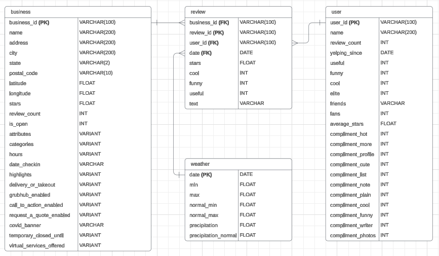

# Designing Data Systems

In this chapter, I covered key foundational concepts of data architecture and its business impact, followed by deep dives into data staging, operational data stores (ODS), and building a data warehouse (DWH). These lessons set the stage for the final project by ensuring a clear understanding of the data flow and system design. Through this course Snowflake - a cloud-based platform has been used.

## Key Concepts Learned

**Importance of Data Architecture**

Data architecture is critical for any organization to ensure consistency, efficiency, and scalability.
I explored why creating a master plan is essential for organizations to eliminate data silos, scale efficiently, and reduce costs.

**OLTP and OLAP Models**

I reviewed the differences between transactional and analytical data systems and how they work together.
OLTP (Online Transaction Processing) is key for operational data, while OLAP (Online Analytical Processing) models enable deep insights.

**Staging Data in Snowflake**

Staging data is vital to bring raw data into a common format and ensure efficient data ingestion and transformation.
The importance of using separate schemas for each data source was emphasized, along with meta-tables to help manage the process.

**Operational Data Store (ODS)**

The ODS integrates data from multiple sources into a single model, ready to be transformed for analytical use.
I explored how to cleanse data, normalize it to eliminate redundancies, and integrate it into a unified enterprise data model.

**Extracting to the Data Warehouse (DWH)**

Finally, I learned how to extract data from ODS to the data warehouse, explored different types of schemas like STAR and SNOWFLAKE, and wrote SQL queries to generate reports for business users.

## Project: Design a Data Warehouse for Reporting and OLAP

The project aimed to integrate Yelp business and review data with climate data. The final objective was to perform analysis on how weather influences customer restaurant reviews.

### Business Scenario

The project involved building a Data Warehouse capable of storing and querying large datasets, ensuring efficient OLAP to discover trends between weather conditions and restaurant reviews.

### Support Material

Datasets from Yelp (academic data about business and covid) and climate data (temperature and precipitation data) used for analysis in the data warehouse project.

### Project Steps

**Data Ingestion:**

Uploaded and staged the Yelp and climate datasets into Snowflake, breaking down large files for easier ingestion.

**Schema Design:**

Created a data architecture plan, ERD and a STAR schema to efficiently store and query the data in Snowflake.

**Data Pipelining:**

Transformed and pipelined the data through the Staging, ODS, and DWH layers for analysis.

**SQL Queries:**

Performed analytical SQL queries.

<a href="SQL">SQL Files</a>
