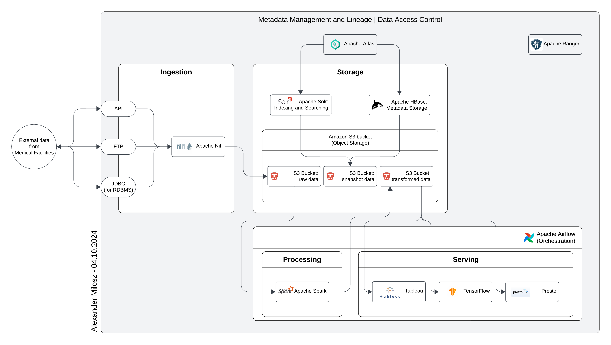

# Big Data Systems

In this chapter, I explored the essential characteristics of big data, its business value, and how companies utilize big data systems.
We focused on the components of the big data ecosystem, diving deep into storage and processing frameworks, NoSQL databases, and data lake design patterns.
I worked with Amazon AWS S3 to work with the various tools available.

## Key Concepts Learned

**Characteristics and Business Value of Big Data**

I studied how organizations derive value from big data through insights, scaling, and automation. The course emphasized the importance of big data in improving decision-making, reducing costs, and enhancing operational efficiency.

**Big Data Ecosystem**

I reviewed the core components of the big data ecosystem, including frameworks for storage and processing such as HDFS, Apache Spark, and NoSQL databases.

**NoSQL Databases**

We explored how NoSQL databases differ from traditional relational databases, focusing on their scalability and flexibility. I also designed a NoSQL data model for handling unstructured data at scale.

**Data Lakes**

The course highlighted the benefits and challenges of implementing a data lake to centralize big data storage. I learned about the scalability, flexibility, and adaptability of data lakes for managing vast amounts of data.

## Project: Designing an Enterprise Data Lake System

The final project involved designing a data lake for a Medical Data Processing Company.
The goal was to integrate a wide range of data sources, including EMR data from medical facilities, to enable real-time insights, machine learning, and analytics.

### Business Scenario

Medical Data Processing Company faced challenges with their SQL-based architecture, which couldn't scale to handle the growing data volumes.
I designed a scalable data lake architecture to process incoming data on the fly and store it centrally, ensuring data could be easily accessed.

### Support Material

Business Requirements and technical requirements, as well as an overview of the old database and its problem have been given.

### Project Steps

**Data Lake Solution Architecture Diagram**

Designed an end-to-end data lake architecture covering ingestion, storage, processing, and serving layers. Created my architecture using open-source tools to avoid vendor lock-in.

**Data Lake Architecture Design Document**

A technical document detailing the architecture, decisions made, assumptions, risks, and scaling strategy. Targeted towards engineers and technical directors.

<a href="DataLakeArchitectureDesign.docx">Design Document</a>

**Executive Presentation**

Created a PowerPoint presentation showcasing the business value of the data lake to non-technical executives. Focused on why the solution solves key business challenges.

<a href="DataLakeExecutivePresentation.pptx">Presentation</a>

**Video Presentation**

Recorded a 8-minute video explaining the data lake value proposition using the presentation slides. Aimed at convincing leadership to adopt the solution.
