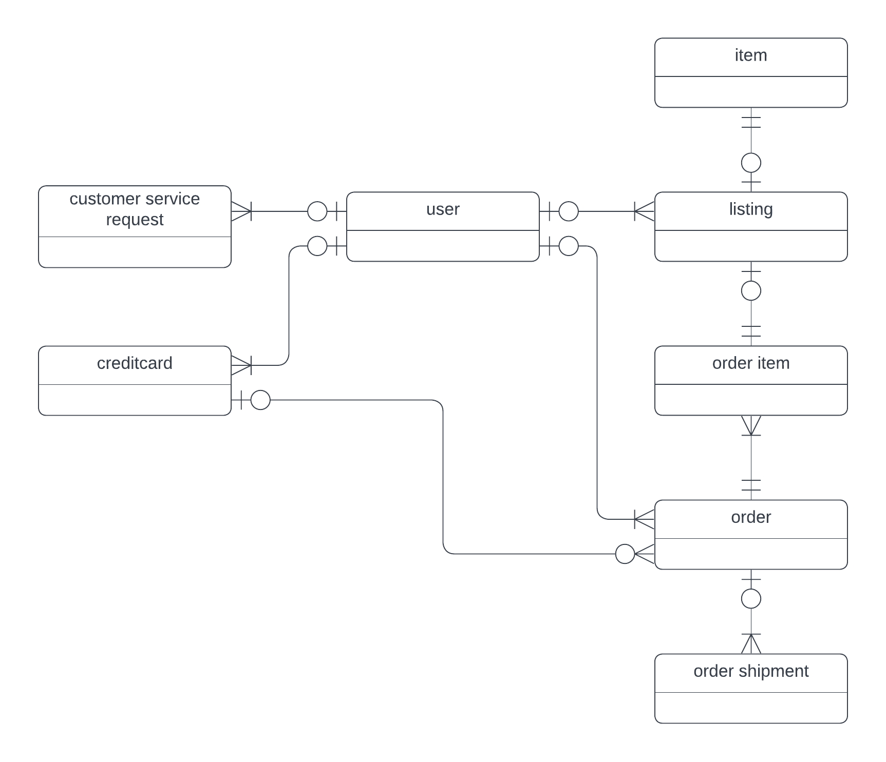
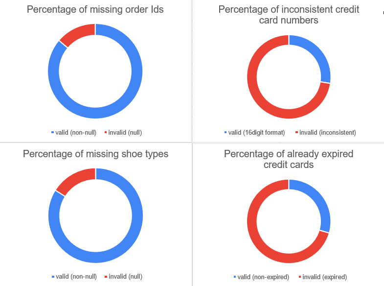
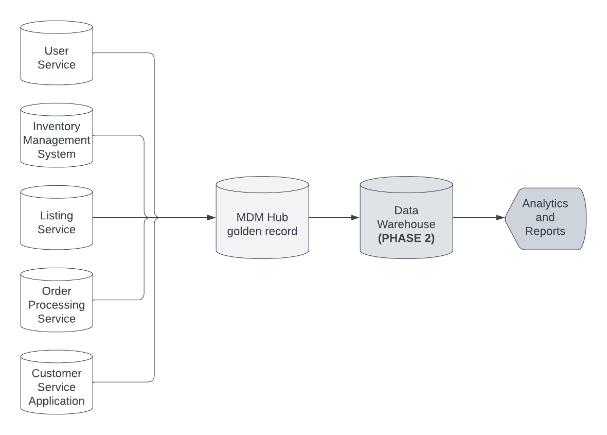

# Data Governance at SneakerPark

In this chapter, I dove into the principles of data governance, its significance, and how SneakerPark, a shoe resell company, can enhance its data management strategies through proper governance.

We explored critical data governance concepts such as Data Quality, Metadata Management, and Master Data Management (MDM) and outlined roles and responsibilities essential for overseeing these practices.

## Key Concepts Learned

**Data Governance Fundamentals**

I studied the foundational elements of data governance, including the policies, procedures, and tools necessary to manage enterprise data.

**Data Quality Management**

I reviewed the six data quality dimensions such as completeness, consistency, and timeliness, along with strategies to improve data quality through rules, audits, and ongoing monitoring.

**Metadata Management**

We explored the need for managing metadata to ensure a clear understanding of the data's origin, meaning, and usage across enterprise systems. Proper metadata management enables better decision-making and integration between systems.

**Master Data Management (MDM)**

A comprehensive look into MDM focused on the importance of creating a "golden record" by consolidating master data from different systems.

## Project: Data Governance at SneakerPark

The final project involved designing a governance framework for SneakerPark, an online shoe reseller.

### Business Scenario

SneakerPark faced challenges with data consistency across systems, leading to issues like mischarges and lost revenue. To address this, I implemented a robust data governance strategy that includes MDM, data quality management, and metadata management.

### Support Material

Business requirements, technical requirements, and data from five systems were analyzed.

### Project Steps

**Enterprise Conceptual Model**

Developed a holistic data model for SneakerPark’s systems, covering Customers, Listings, and Orders.

**Enterprise Data Catalog**

Documented key metadata attributes in an Excel-based Data Catalog for all data entities across the enterprise' systems.

**Data Profiling**

Identified three major data quality issues and one I can forsee in the future, defined remediation strategies, and created a document detailing the findings.

**Data Quality Dashboard**

Designed a dashboard to monitor the identified data issues, including potential future issues.

**MDM Architecture**

Sketched a Consolidated MDM architecture, including detailed reasoning for its suitability for the company.

**Matching Rules**

Defined rules for matching Item and Customer entities across different systems.

**Governance Roles**

Outlined data governance roles and responsibilities to ensure smooth management and oversight of the reseller's data.